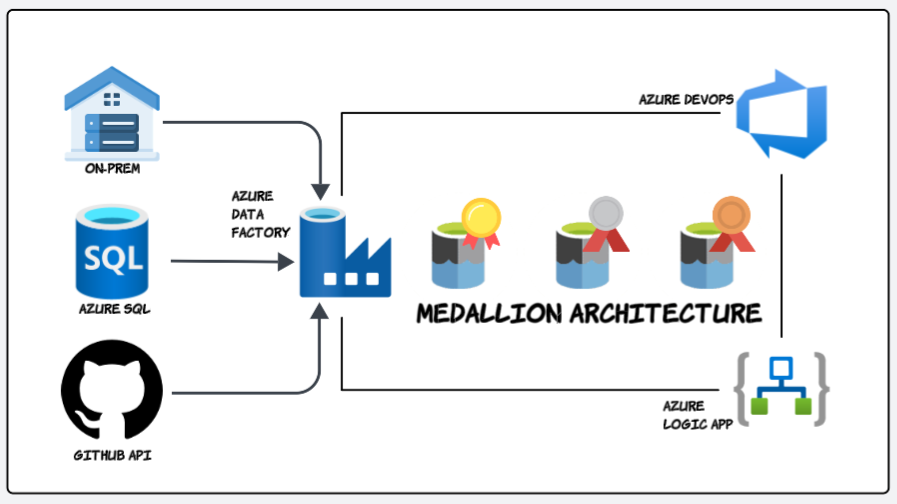

# Azure Data Factory Project with Azure DevOps

## Project Overview
This project demonstrates an end-to-end data engineering solution using Azure Data Factory and Azure DevOps, implementing modern data architecture patterns and automated deployment practices.

## Architecture
- **Medallion Architecture**: Implementation of Bronze (Raw), Silver (Validated), and Gold (Business) layers
- **Modern Data Stack**: Integration of various Azure services for a robust data platform
- **DevOps Integration**: Automated deployment and version control systems

## Key Features
- Data Migration & Integration
  - On-premises to Azure Blob Storage migration
  - REST API data ingestion
  - Azure SQL Database to Data Lake transformation
  
- Technical Implementation
  - Incremental data loading patterns
  - Multi-format data transformations (Delta Lake, Parquet, JSON)
  - Automated pipeline orchestration
  - Logic Apps monitoring and alerts

- Data Processing
  - ETL/ELT workflows
  - Data quality checks
  - Transformation logic
  
## Technology Stack
- Azure Data Factory
- Azure DevOps
- Azure SQL Database
- Azure Data Lake Storage Gen2
- Azure Logic Apps
- Delta Lake
- Git

## Pipeline Structure
- Source data extraction
- Raw data ingestion
- Data transformation
- Load to target systems
- Monitoring and logging

## Contributing
Feel free to submit issues, fork the repository, and create pull requests for any improvements.

